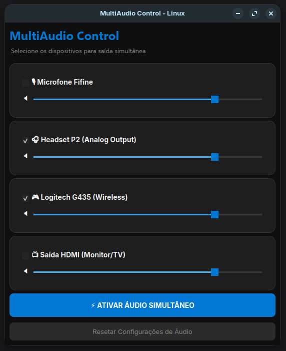

# MultiAudio Control

Sabe quando você liga a TV pelo HDMI e o fone no painel frontal e quer que saia o mesmo áudio nos dois ao mesmo tempo no Linux? Ou quando quer usar um fone P2 convencional em conjunto com um G435 sem fio (ou qualquer outro fone USB)? 

O PulseAudio/Pipewire teoricamente faz isso criando *null sinks* e *loopbacks*, mas é bem chato ficar digitando comandos no terminal ou usando o `pavucontrol` tentando adivinhar qual interface é a certa.

Fiz esse app em PyQt6 pra facilitar a vida. Ele lista suas placas de áudio físicas reais, você marca o que quer usar, e ele faz o trabalho sujo via `pactl`.



## 📥 Download rápido (Apenas baixar e usar)

Se você não quer compilar ou só quer testar direto, vá na seção **[Releases](../../releases/latest)** (no painel da direita do repositório) e baixe o aplicativo `MultiAudioControl` pronto.

Basta dar permissão de execução (`chmod +x MultiAudioControl`) e rodar. Ele é portátil.

## Como a mágica acontece (por baixo dos panos)

Quando você clica em "Ativar", o script basicamente executa:
1. Um `pactl load-module module-null-sink` criando uma placa virtual emulada (`MultiOut`).
2. Faz o binding de vários `module-loopback` ligando o áudio deste `MultiOut` pra cada placa física que você marcou, com uma latência levemente ajustada.
3. Define esse `MultiOut` como o dispositivo de saída principal do seu SO.

O botão de reset limpa **somente os IDs** da memória que o programa carregou naquela sessão. Ou seja, se você usa o OBS com cabos virtuais, ele não vai dar *unload* nas suas próprias paradas, só nas que ele mesmo gerou.

## Como rodar o executável pronto

Só baixar ou ir na pasta `dist` e abrir.
*Dica: na inicialização do código incluí uma checagem rápida caso você use Ubuntu/Debian. O Qt6 precisa muito do pacote `libxcb-cursor0` senão ele crasha, então ele faz essa verificação e te pede uma senha graficamente se precisar dar um `apt install`.*

```bash
# Dá a permissão se precisar
chmod +x ./dist/MultiAudioControl

# Só iniciar
./dist/MultiAudioControl
```

## Como rodar/compilar do zero

Se você quiser puxar o repositório pra modificar o layout ou tentar adicionar outras lógicas:

```bash
# Cria seu venv e instala as dependências
python -m venv .venv
source .venv/bin/activate
pip install -r requirements.txt

# Roda solto
python main.py
```

Pra gerar o executável de novo após modificar algo, basta rodar:
```bash
pyinstaller MultiAudioControl.spec
```

## Dependências

Você precisa que o seu sistema tenha o `pactl` rodando e acessível no path (na maioria das distros que usa PulseAudio ou PipeWire hoje, isso é nativo).